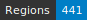

HTRomance, Modern language corpus of ground-truth for Handwritten Text Recognition and Layout Segmentation
==========================================================================================================
   

<!-- Custom Zone -->

## Introduction

This ground-truth dataset has been built around the idea of offering a variety of data to improve the coverage of modern cursive handwriting, in the perspective of building generic transcription models. Each manuscript includes 1 to 10 images taken from a single hand or multihand manuscript held at the Bibliothèque nationale de France (BnF) and available through Gallica. 
The number of lines per page depends on the documents. It varies from 4 to 42 for the densest, with an average amount of 15 lines per pages. 

<!--
> [!NOTE]
> The repository contains two XML files per image. The ones suffixed with `.chocomufin.xml` are normalized in order to be compliant with other datasets following the same guidelines. The others are more specific to this repository. We recommend using the normalized documents.
-->

## Credits

* Segmentation: Jade Norindr & Alix Chagué.
* Transcriptions: Jade Norindr.
* Supervision and manuscript selection: Alix Chagué <!-- remember to add Jade Norindr when her selection is added -->
* Project management: Thibault Clérice & Alix Chagué.

<!-- Rien ne doit être modifié manuellement après la balise Start Auto -->

<!-- Start Auto -->

## Transcription guidelines

The transcription guidelines are described in a paper available on [HAL](https://hal-enc.archives-ouvertes.fr/hal-03828353) and published in the Journal for Open Humanities Data. The paper provides specific details about the selection process, the transcription methods and choices, as well as details about the output (mainly the [Generic CREMMA Model for Medieval Manuscripts (Latin and Old French)](https://zenodo.org/record/7234166#.Y7f69afMJhE) for [Kraken](https://kraken.re))

## Data

ALTO and images can be found in the directory called `data/`. Each subfolder of `data/` corresponds to a 
single manuscript, identified by its shelfmark.

<!-- BeginTable -->

| Shelfmark                                                                      | Links                                    | Range   | Type   |   Century | Color   |   Pages |   Main Zones |   Lines |   Characters | Genre                     | Content                                                                                                                                                                                                                                                                                                                                                                            |
|--------------------------------------------------------------------------------|------------------------------------------|---------|--------|-----------|---------|---------|--------------|---------|--------------|---------------------------|------------------------------------------------------------------------------------------------------------------------------------------------------------------------------------------------------------------------------------------------------------------------------------------------------------------------------------------------------------------------------------|
| [BnF Français 4108](https://gallica.bnf.fr/ark:/12148/btv1b525049701)          | [📁](data/bnf-français-4108)             | 1r-102v | prose  |        17 | ✓       |       5 |            4 |     111 |         3982 | prose                     | Contient : 1° « Remonstrances du parlement de Navarre au roy [Louis XIV], contre Mr le comte de Guiche, viceroy de Navarre » ; 2° « Response de Mr le comte [ANTOINE III] DE GUICHE ausdittes remonstrances » Description :  Numérisation effectuée à partir d'un document original.                                                                                               |
| [BnF 4-S-3789 (2)](https://gallica.bnf.fr/ark:/12148/bpt6k322032d)             | [📁](data/bnf-4-s-3789-(-2))             | NP-NP   | prose  |        17 | ✓       |       5 |            5 |     109 |         1764 | traité                    | Jugement de phisionomie conforme aux principes d'Aristote et des autres philosophes. Tiré des differentes partes du corps humain Par le R. P. F. Paul Grisaldi de Perouse docteur en theologie de l'ordre des ff prescheurs... Auteur  :  Grisaldi, Paolo (15..-1614). Auteur du texte                                                                                             |
| [BnF Français 2394](https://gallica.bnf.fr/ark:/12148/btv1b525066874)          | [📁](data/bnf-français-2394)             | 7r-9r   | prose  |        17 | ✓       |       5 |            4 |      67 |         1947 | traité                    | « Discours sur le tableau du Passage du Rhin, à monsieur Le Brun », par « F. LE BRUN », en latin et en français.                                                                                                                                                                                                                                                                   |
| [BnF Français 8204](https://gallica.bnf.fr/ark:/12148/btv1b8551123b)           | [📁](data/bnf-français-8204)             | 1r-77v  | prose  |        17 | ✓       |       6 |            7 |      45 |         1871 | armorial                  | « Les noms et surnoms, qualitez, armes et seigneuries de tous les cardinaux, prelats et commandeurs de l'Ordre du St -Esprit, qui ont esté faicts par le très crestien roy de France et de Navarre, Louis treiziesme du nom... » (1610-1621).                                                                                                                                      |
| [BnF Ms-3561](https://gallica.bnf.fr/ark:/12148/btv1b52507329r)                | [📁](data/bnf-ms-3561)                   | xr-yv   | prose  |        17 | ✓       |       5 |            5 |      91 |         2393 | Traité                    | « Testament politique de l'éminantissime Armand, cardinal duc de Richelieu, pair et grand admiral de France. ». « Testament politique de l'éminantissime Armand, cardinal duc de Richelieu, pair et grand admiral de France. » Tome Ier.                                                                                                                                           |
| [BnF GE DD-2025 (RES)](https://gallica.bnf.fr/ark:/12148/btv1b55008553r)       | [📁](data/bnf-ge-dd-2025-(-res))         | 4r-130v | prose  |        18 | ✓       |      10 |           11 |     176 |         6289 | divers documents          | _                                                                                                                                                                                                                                                                                                                                                                                  |
| [BnF Français 19670](https://gallica.bnf.fr/ark:/12148/btv1b52000470c)         | [📁](data/bnf-français-19670)            | 1r-225r | prose  |        18 | ✓       |      10 |           17 |     206 |         7601 | recueil de correspondance | Correspondance de D. Guillaume LE SUEUR († 1748).                                                                                                                                                                                                                                                                                                                                  |
| [BnF NAF 1103](https://gallica.bnf.fr/ark:/12148/btv1b525110430)               | [📁](data/bnf-naf-1103)                  | 1-NP    | prose  |        18 | ✓       |       4 |            4 |      88 |         3274 | traité d'histoire         | Abrégé de l'histoire de Marseille, depuis sa fondation jusqu'en 1733, par F. M[ALLAVAL], l'an 1733 ».                                                                                                                                                                                                                                                                              |
| [BnF Français 15148](https://gallica.bnf.fr/ark:/12148/btv1b525025055)         | [📁](data/bnf-français-15148)            | 1-484   | mixed  |        18 | ✓       |       6 |            4 |      81 |         1803 | prose                     | « Pièces critiques et satyriques pour servir à l'histoire du tems. — A Pantin, chez Jean Satire, rue des Mauvaises Pensées, à la Sotise ».                                                                                                                                                                                                                                         |
| [BnF RESERVE 8-YA3-27 (4,52)](https://gallica.bnf.fr/ark:/12148/btv1b8442824z) | [📁](data/bnf-reserve-8-ya3-27-(-4,-52)) | NP-NP   | prose  |        18 | ✓       |       5 |            5 |     113 |         3509 | prose                     | [Article CXX des Memoires pour l'histoire des Sciences et des Beaux arts. Jugemens sur les principaux ouvrages exposés au Louvre en 1751.]                                                                                                                                                                                                                                         |
| [BnF RESERVE QB-370 (2)-FT 4](https://gallica.bnf.fr/ark:/12148/btv1b6940199f) | [📁](data/bnf-reserve-qb-370-(-2)-ft-4)  | NP-NP   | prose  |        18 | ✓       |       2 |            2 |      22 |          538 | ordre royal               | Autographe de Louis XVI. Paris, 15 avril 1791                                                                                                                                                                                                                                                                                                                                      |
| [BnF 2011/091/ACM05-20](https://gallica.bnf.fr/ark:/12148/btv1b10466041s)      | [📁](data/bnf-2011/-091/-acm05-20)       | NP      | prose  |        18 | ✓       |       1 |            4 |      16 |          576 | lettre                    | Archives du cabinet des médailles, série chronologique. Archives du cabinet des médailles (1794-an IX). Acquisitions provenant de la Monnaie, du Garde-meuble. Lettre de Capperonier au directeur général de l'Instruction publique, demandant la remise au Cabinet de la bordure contenant les miniatures de Louis XIV et sa famille par Antoine Benoist (Paris, 13 nivôse an V). |
| [BnF 8-Q PIECE-1904](https://gallica.bnf.fr/ark:/12148/bpt6k1163246p)          | [📁](data/bnf-8-q-piece-1904)            | xr-yv   | prose  |        19 | ✓       |       5 |            8 |     199 |         7681 | monographie imprimée      | Bibliographie des travaux de M. Moïse Schwab (1860-1904) / par P. Hildenfinger                                                                                                                                                                                                                                                                                                     |

<!-- EndTable -->

## Metrics

<!-- StartMetric -->

### Total number of pages

69

### Regions

- TitlePageZone (9)
- MainZone (80)
- NumberingZone (41)
- Not specified (1)
- MarginTextZone (10)
- StampZone (10)
- DecorationZone (2)
- GraphicZone (7)

### Lines

- HeadingLine (60)
- DefaultLine (1245)
- InterlinearLine (4)
- Not specified (15)

<!-- EndMetric -->

## Funding

This project was funded by the Bibliothèque nationale de France through the 2022 project calls from
[Datalab](https://www.bnf.fr/fr/bnf-datalab) for 2023.

## Cite the project

> Clérice, T., Chagué, A., Gille-Levenson, M., Brisville-Fertin, O., Pinche, A., Camps, J., Fischer, F., Boschetti, F., Guadagnini, E., Guilhem Couffignal, G., Canteaut, O., Romary, L., Reboul, M., Perreaux, N., Poibeau, T., Smith, M., Norindr, J., Glaise, A., Navas Farré, M., Bordier, J., Leroy, N., Alba, R., & Rubin, G. *HTRomance* [Data set]. https://htromance-project.github.io/
```
@misc{Clerice_HTRomance,
author = {Clérice, Thibault and Chagué, Alix and Gille-Levenson, Matthias and Brisville-Fertin, Olivier and Pinche, Ariane and Camps, Jean-Baptiste and Fischer, Franz and Boschetti, Federico and Guadagnini, Elisa  and Guilhem Couffignal, Gilles and Canteaut, Olivier and Romary, Laurent and Reboul, Marianne and Perreaux, Nicolas and Poibeau, Thierry and Smith, Marc and Norindr, Jade and Glaise, Anthony and Navas Farré, Marina and Bordier, Julie and Leroy, Noé and Alba, Rachele and Rubin, Giorgia},
title = {{HTRomance}},
url = {https://htromance-project.github.io/}
}
```

## Infrastructure

This project relied on the [CREMMA infrastructure](https://www.dim-map.fr/projets-soutenus/cremma/).
